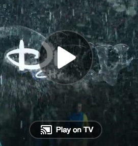
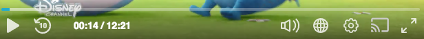

# QA Instructions - How to Setup Chromecast Sender & Receiver

To start test chromecast sender and receiver we will need the following assets:
1. kaltura player bundle which includes the cast framework.
2. playkit sender bundle which intercats with the cast sender sdk.
3. playkit receiver bundle which intercats with the cast receiver sdk.

## Setup the Sender Plugin 
Follow the steps below:
1. Deploy to the QA env the kaltura player bundles attached:
- `kaltura-ovp-cast-player.js` 
-  `kaltura-tv-cast-player.js`

2. Deploy to the QA env the sender plugin bundle attached:
`playkit-cast-sender.js`

3. Create a new _ui_conf_ with the cast-sender and the kaltura cast player modules.

4. Copy & paste any working test page and update the player script url to the new url which including the new _ui_conf_ id.
4. In your test page, enter a cast config:

    ```js
    var playerConfig = {
        ...
        cast: {
            receiverApplicationId: 'B202D11C'
        }
        ...
    };
    ```
    
5. Refresh the page and observe a cast before play button along with a cast button during the playback:





## Setup the Receiver Application
Follow the steps below:
1. Deploy to the QA env the receiver player bundle attached:
- `playkit-cast-receiver.js`

2. Create an empty and clean `index.html` file.

3. Now we are need to load in this file 3 different assets:
    - cast receiver framework (CAF).
    - playkit receiver sdk.
    - kaltura player.
    
    Example:
    
  ```html
  <!DOCTYPE html>
  <html lang="en">
  <head>
    <meta charset="UTF-8">
  <script src="//www.gstatic.com/cast/sdk/libs/caf_receiver/v3/cast_receiver_framework.js"></script> 
  <script src="path/to/kaltura/player/url"></script> 
  <script src="path/to/receiver/sdk/url"></script> 
  </head>
  <body>
  </body>
  </html>
   ```

Now, lets add the _cast media element_ and some code that will initiate the cast application.
under the `<body>` tag, add the follow:
   
```html
<cast-media-player/>
<script>
  KalturaPlayer.cast.receiver({
    logLevel: 'DEBUG',
    provider: {
      partnerId: 1091,
      uiConfId: 'YOUR_UI_CONF_ID'
    }
  });

  cast.framework.CastReceiverContext.getInstance().start();
</script>
```

## Deploy the Receiver Application

Now all we got left is to deploy the index.html file we create earlier.

After you've done that, enter the [Google Cast Developer Console](https://cast.google.com/u/1/publish/#/overview) and change the url for the application **Playkit Receiver V3 - QA** to your hosted index.html url. 

